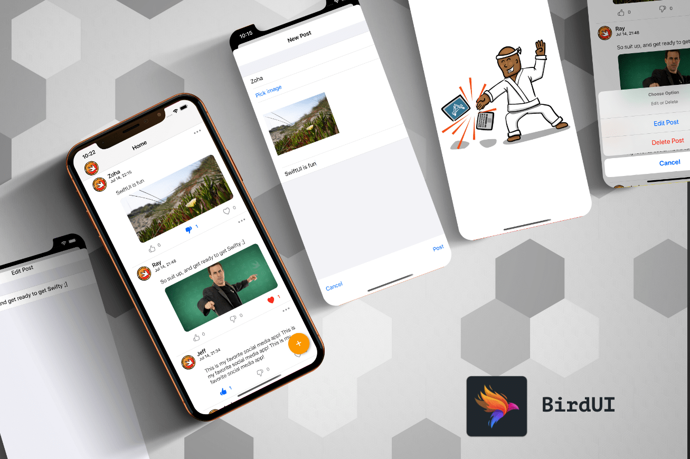

# BirdUI

## About
**BirdUI** is a simple social app. This app contains all the basic features of a social app.


## 📸 Screenshots



## Team Members:
- Emilio
- MD Abir Hasan Zoha


## App Features:
- View Posts in a List
- View post image in a dedicated page.
- Create new post with or without image.
- Add reaction (like, dislike, love) to any post
- View the total count of the reactions

## Concept, we have learned by doing this project
- Basic of SwiftUI
- Collaboration in GitHub
- Pull Request in GitHub
- Code review in GitHub
- Working as a team


### Contact - Let's become friend
- Twitter [Emilio](https://twitter.com/zoha131) || [Zoha](https://twitter.com/zoha131)
- Github [Emilio](https://github.com/zoha131) || [Zoha](https://github.com/zoha131)
- Linkedin [Emilio](https://www.linkedin.com/in/zoha131/) || [Zoha](https://www.linkedin.com/in/zoha131/)
- Facebook [Emilio](https://www.facebook.com/zoha131) || [Zoha](https://www.facebook.com/zoha131)

<p>
Don't forget to star ⭐ the repo it motivates me to share more open source
</p>

## License

```
MIT License

Copyright (c) 2020 MD Abir Hasan Zoha

Permission is hereby granted, free of charge, to any person obtaining a copy
of this software and associated documentation files (the "Software"), to deal
in the Software without restriction, including without limitation the rights
to use, copy, modify, merge, publish, distribute, sublicense, and/or sell
copies of the Software, and to permit persons to whom the Software is
furnished to do so, subject to the following conditions:

The above copyright notice and this permission notice shall be included in all
copies or substantial portions of the Software.

THE SOFTWARE IS PROVIDED "AS IS", WITHOUT WARRANTY OF ANY KIND, EXPRESS OR
IMPLIED, INCLUDING BUT NOT LIMITED TO THE WARRANTIES OF MERCHANTABILITY,
FITNESS FOR A PARTICULAR PURPOSE AND NONINFRINGEMENT. IN NO EVENT SHALL THE
AUTHORS OR COPYRIGHT HOLDERS BE LIABLE FOR ANY CLAIM, DAMAGES OR OTHER
LIABILITY, WHETHER IN AN ACTION OF CONTRACT, TORT OR OTHERWISE, ARISING FROM,
OUT OF OR IN CONNECTION WITH THE SOFTWARE OR THE USE OR OTHER DEALINGS IN THE
SOFTWARE.
```